<div align="center">


# Finora
### AI-Powered Personal Finance Platform

**Every number comes from the database. The AI only explains it.**

A full-stack finance platform that categorises transactions with an explainable
ML model, flags unusual spending, forecasts cash flow, scans receipts and answers
questions in plain English, without ever letting a language model invent a
figure.

<br>


<br>

**[Source code](https://github.com/Divyanshi12coder/finora-ai-personal-finance)** ·
**[Live demo](https://finora-ai-personal-finance.vercel.app/)** ·
**[Interactive case study](index.html)** ·
**[Author](https://github.com/Divyanshi12coder)**

</div>

> [!NOTE]
> This repository is the **technical case study** for Finora. The application
> itself lives in
> [`finora-ai-personal-finance`](https://github.com/Divyanshi12coder/finora-ai-personal-finance).
> Every claim below was checked against that source code. Anything that could
> not be verified is marked **`[VERIFY]`**. All screenshots are real captures
> of the running app showing fictional seeded data.

---

## Contents

[Product preview](#product-preview) ·
[At a glance](#at-a-glance) ·
[Problem](#the-problem) ·
[Solution](#the-solution) ·
[Architecture](#system-architecture) ·
[Data flow](#data-flow) ·
[ML pipeline](#machine-learning-pipeline) ·
[Anomaly detection](#anomaly-detection) ·
[Forecasting](#cash-flow-forecasting) ·
[OCR](#receipt-ocr-pipeline) ·
[Health score](#financial-health-score) ·
[Insight engine](#insight-engine) ·
[AI assistant](#ai-assistant) ·
[Database](#database-architecture) ·
[API](#api-architecture) ·
[Frontend](#frontend-architecture) ·
[Security](#security) ·
[Deployment](#deployment-architecture) ·
[Challenges](#engineering-challenges) ·
[Decisions](#key-engineering-decisions) ·
[Testing](#testing) ·
[Reliability](#observability--reliability) ·
[Current state](#current-state) ·
[Roadmap](#future-roadmap) ·
[Learnings](#what-i-learned) ·
[Interview Q&A](#interview-talking-points) ·
[Structure](#project-structure) ·
[Run it](#local-development)

---

## Product preview

<table>
<tr>
<td width="50%"><b>Dashboard</b><br>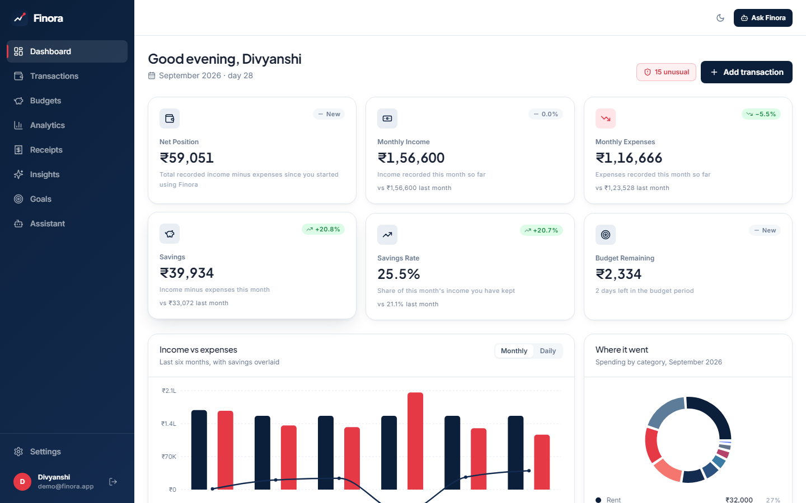</td>
<td width="50%"><b>Analytics</b><br></td>
</tr>
<tr>
<td><b>Transactions</b>: live ML categorisation<br></td>
<td><b>Insights</b>: deterministic findings and anomaly flags<br>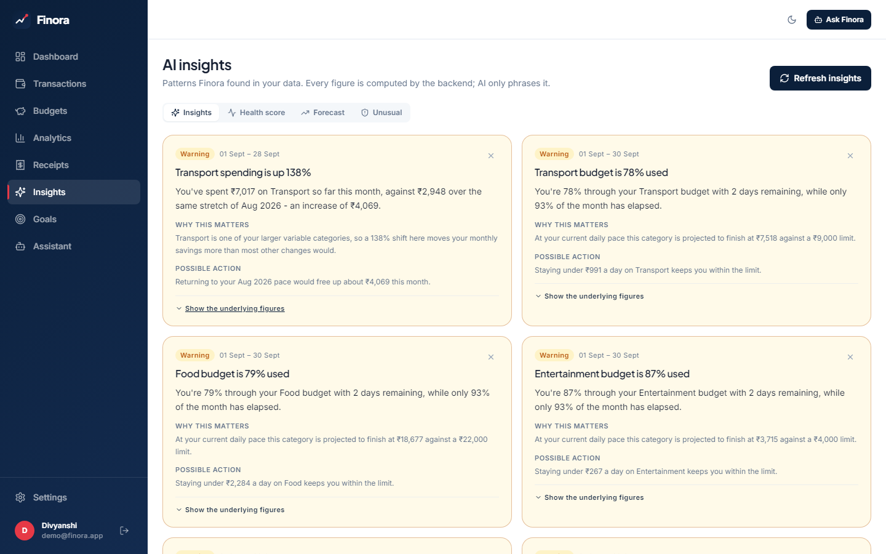</td>
</tr>
<tr>
<td><b>AI assistant</b>: tool trace expanded<br></td>
<td><b>Receipt OCR</b>: graceful fallback when Tesseract is missing<br>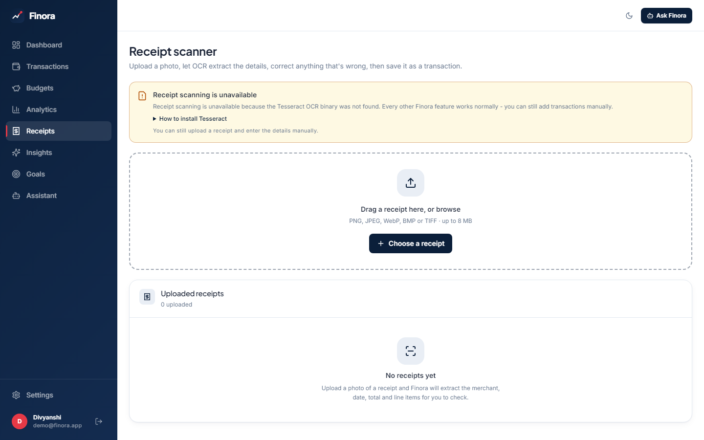</td>
</tr>
<tr>
<td><b>Forecast</b>: 80% prediction band<br>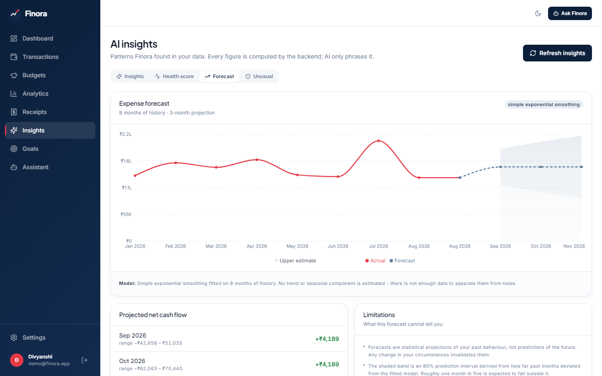</td>
<td><b>Budget recommendations</b><br></td>
</tr>
</table>

<details>
<summary>More screens: budgets, goals, dark mode, landing page</summary>
<br>

| Budgets | Goals |
|---|---|
|  | 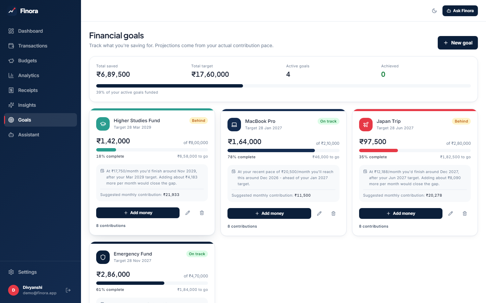 |
| **Dark mode** | **Landing page** |
| 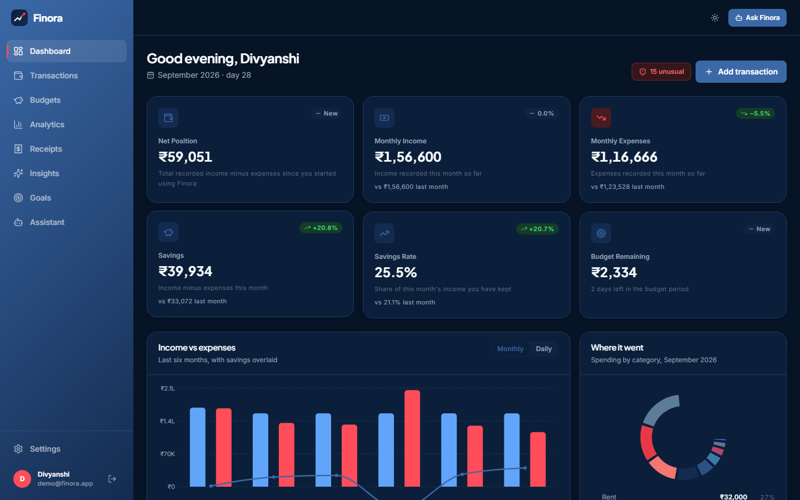 | 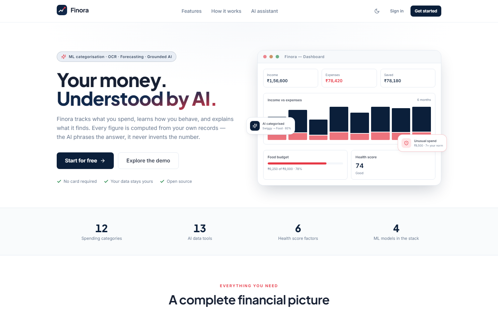 |

</details>

<sub>Screenshots are produced by `frontend/scripts/capture-screenshots.mjs`
(Playwright) in the main repository. It signs in as the demo user and captures
each view without mocking. The demo account holds nine months of fictional
transactions.</sub>

---

## At a glance

| Area | Technology | Verified in |
|---|---|---|
| Frontend | React 18 · TypeScript 5.7 · Vite 6 · Tailwind CSS 3 · Framer Motion · Recharts · Lucide React · React Router | `frontend/package.json` |
| Backend | FastAPI 0.115 · Pydantic v2 · pydantic-settings · SQLAlchemy 2.0 · Alembic · uvicorn | `backend/requirements.txt` |
| Database | PostgreSQL 16 (psycopg 3); SQLite fallback for local development only | `docker-compose.yml`, `app/config.py` |
| Auth | PyJWT (HS256) · bcrypt | `app/utils/security.py` |
| ML / data | scikit-learn 1.7 · statsmodels · pandas · NumPy · joblib | `ml/`, `app/ml/` |
| OCR | Tesseract (pytesseract) · OpenCV (headless) · Pillow | `app/ocr/` |
| AI provider | Optional. Anthropic or OpenAI-compatible APIs over plain `httpx` | `app/ai/provider.py` |
| Infrastructure | Docker · Docker Compose · nginx · Render (`render.yaml`) · Vercel · GitHub Actions | repository root, Vercel dashboard |
| Hosting | **Vercel** for the frontend ([live](https://finora-ai-personal-finance.vercel.app/)) · **Render** for the API and PostgreSQL | `render.yaml` + Vercel dashboard (no `vercel.json` committed) |

**Scope, counted from the source:** 64 HTTP routes across 8 routers ·
13 database tables · 14 services · 13 assistant retrieval tools · 8 insight
detectors · 16 frontend pages · 236 backend test functions (281 collected tests
per the main README) · 36 frontend tests.

> [!IMPORTANT]
> These are **size counts**, not outcomes. Finora is a portfolio project. It
> claims no users, revenue or production accuracy.

---

## The problem

| Gap | Why it matters in practice |
|---|---|
| **Fragmented information** | Transactions, receipts, budgets and goals live in different places, so "How am I doing?" has no single answer. |
| **Manual categorisation** | Bank narrations such as `UPI/SWGGY/428391/Food order` or `POS 4521XXXX7823 STARBUCKS MUMBAI` are noisy. Each wrong category corrupts every budget and chart built on it. |
| **Hidden spending patterns** | Monthly totals don't show *which* category or merchant caused a change. |
| **Unexpected transactions** | A one-off ₹65,000 purchase is easy to miss. Fixed rules like "flag anything over ₹5,000" don't fit anyone's real spending. |
| **No forward view** | Most tools only look backwards. People want to know what next month is likely to look like, and how uncertain that estimate is. |
| **Receipts are images** | Merchant, date, GST split and total have to be retyped by hand. |

There is also a risk specific to AI finance products: **ask a language model
about your money and it will produce a plausible number.** In this domain a
confident wrong figure is worse than no answer. Much of Finora's design exists
to prevent that.

---

## The solution

Finora combines five kinds of computation. The source of truth is always the
database plus deterministic code, never the language model.

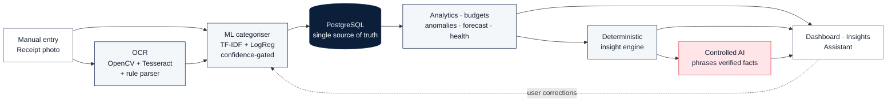

| Layer | Its job | Why it belongs there |
|---|---|---|
| **Financial data** | Ledger in `Numeric(14,2)`; derived values recomputed on read | One source of truth that can't drift |
| **ML** | Text → category; multivariate outliers | Inputs are ambiguous, so learning is the right tool |
| **OCR** | Image → structured receipt fields | Rule-based parsing that can be audited, with per-field confidence |
| **Analytics + rules** | Budgets, health score, insights, forecasts | Users need exact, reproducible numbers |
| **Controlled AI** | Turning verified facts into prose | Optional. With no key, the numbers are identical. |

---

## System architecture

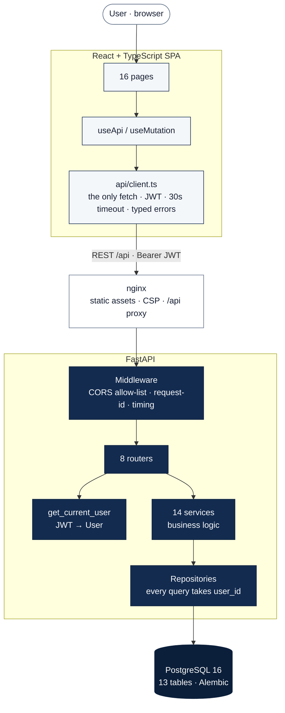

The analytical subsystems sit behind the service layer. The API is always the
only entry point to them:

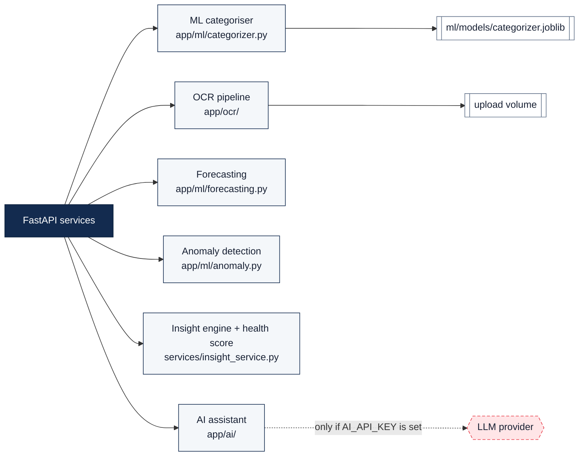

**Layer by layer**

| Layer | Responsibility | Deliberately does *not* |
|---|---|---|
| **React SPA** | Rendering, interaction, form state | Hold secrets, calculate financial figures, touch the DB |
| **`api/client.ts`** | Auth header, timeout, error normalisation, 401 → login | Get bypassed. No other module calls `fetch`. |
| **nginx** | Serve the build, set security headers, reverse-proxy `/api` | Run any application logic |
| **Middleware** | CORS, `X-Request-ID`, `X-Process-Time-Ms`, 4xx/5xx logging | Swallow errors silently |
| **Routers** | HTTP: status codes, Pydantic schemas, dependency injection | Contain business rules |
| **`get_current_user`** | One authentication gate for all protected routes | Get reimplemented per route |
| **Services** | Business logic and orchestration | Know about HTTP |
| **Repositories** | Query construction; require `user_id` | Offer a query path without an owner |
| **`ml/`, `ocr/`** | Pure computation on plain data | Touch the database |
| **`ai/`** | Tool routing, fact assembly, provider abstraction | Do arithmetic or give the model DB access |

> [!TIP]
> **What makes it interesting:** the ML, OCR and LLM subsystems are all
> *optional at runtime*. Each exposes a `status()`, is reported by
> `/api/health`, and degrades to a clear message for its own feature only. The
> API boots and serves everything else even when all three are missing.

---

## Data flow

The path of a manually entered transaction, as implemented:

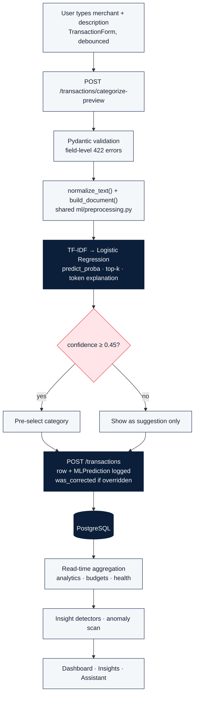

Two implementation details matter here:

1. **Nothing derived is stored.** Budget spend and dashboard totals are
   recomputed from transactions on every read, so they can never disagree
   with the ledger.
2. **Every prediction is audited.** Each prediction is written to
   `ml_predictions`, and a later category change marks it as corrected. That
   table is both the model's audit trail and its next training set.

---

## Machine learning pipeline

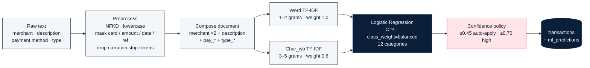

### Why TF-IDF

Transaction text is short and dominated by merchant names, so a sparse
representation of those tokens works well. **Word 1–2 grams** capture merchants
and phrases ("salary credit", "sip installment"). **Character 3–5 grams**
(`char_wb`) handle the spelling noise that is everywhere in bank narrations,
such as `SWGGY`, `AMAZONIN` or `STARBUCKSCOFF`, which a word-only model can't
match. Repeating the merchant twice is a simple way to up-weight the strongest
signal without a custom feature pipeline.

### Why Logistic Regression

- Trains in seconds on a CPU, which means **the model can be trained inside
  `docker build`**.
- `predict_proba` gives a **confidence score** the UI shows and the auto-apply
  policy uses.
- Linear coefficients make **explanations honest**: a token's contribution is
  `tfidf × coefficient`, and the UI shows the tokens that drove a prediction.
- It produces a small artefact file with no GPU or model server.

### Training data

`ml/build_dataset.py` **deterministically** generates `ml/datasets/seed_transactions.csv`:
1,848 rows across 12 categories, using real merchant names and fictional
transactions. It was deliberately made hard, with ambiguous merchants (Amazon
appears under Shopping, Entertainment, Education and Food), garbled merchant
names, rows with no merchant, and raw narration. **CI regenerates the file and
fails if it doesn't match the committed CSV byte-for-byte.** User corrections
exported by `ml.export_corrections` (text fields only, with no amounts or user
IDs) are merged in at the next training run.

### Training and evaluation

`python -m ml.train` performs a stratified 80/20 split, fits the pipeline,
reports accuracy, macro precision, recall and F1, a confusion matrix and 5-fold
stratified CV, then **refits on all data** and writes
`ml/models/categorizer.joblib` plus a JSON metrics report (recording the
dataset, split, sklearn and Python versions).

> [!WARNING]
> **About metrics.** The main repository's README records held-out numbers from
> one training run. They measure performance on **synthetic demonstration
> data**, not real bank statements, so they are not repeated here as a headline
> claim. Reproduce them with `python -m ml.train`. A test fails if accuracy
> reaches 1.0: an earlier dataset scored 100% because each merchant mapped to
> exactly one category, which made the classifier a lookup table.

### Inference and FastAPI integration

- **One preprocessing module** (`ml/preprocessing.py`) is imported by both the
  training script and the API, which prevents train/serve skew. The backend
  adds the repository root to `sys.path`, and the Docker image copies `ml/`
  next to `app/` (`PYTHONPATH=/srv`).
- `ml/model_store.py` loads the artefact **once per process behind a thread
  lock**, checks its `PIPELINE_VERSION`, and returns an "unavailable" model
  instead of raising if the file is missing.
- `app/ml/categorizer.py` applies the confidence policy.
  `categorization_service` maps the label to the user's `Category` row and logs
  the prediction.
- `reload_model()` **hot-swaps** a retrained artefact without restarting the API.

### Model artefacts

Artefacts are **build outputs** and are gitignored. The Docker image runs
`python -m ml.build_dataset && python -m ml.train --no-cv` during the build, and
CI uploads `categorizer.joblib` plus its metrics JSON as a workflow artifact
(14-day retention).

---

## Anomaly detection

**"Unusual" means unusual for this user**, measured against their own
365-day history. There is no global threshold anywhere in the code.

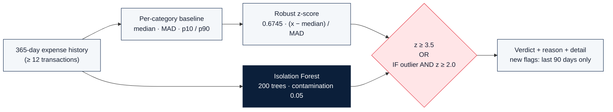

| Signal | Type | Detail |
|---|---|---|
| Modified z-score (median/MAD) | **Deterministic statistic** | Per category once it has ≥ 5 samples, otherwise the overall baseline. Threshold 3.5 (Iglewicz & Hoaglin). |
| Isolation Forest | **ML (unsupervised)** | Six features: log amount, amount ÷ category median, weekday, day of month, merchant familiarity, recency gap since the last visit to that merchant |
| Agreement rule | Deterministic | An Isolation Forest flag counts only if z ≥ 2.0, which keeps false alarms down |

**Edge cases handled.** Identical subscription amounts (199, 199, 199…) make MAD
zero, so the code falls back to the mean absolute deviation, and if that is also
zero it treats any deviation from a constant series as unusual.

**How results are shown.** Each flag carries a sentence that anyone can
understand, for example:

> ₹64,990 is 29.0× your typical Shopping transaction (median ₹2,238, usual range ₹725–₹3,860).

Flags appear in Insights and on the dashboard. The user can mark a flag
*confirmed*, *expected* or *ignored* via
`POST /transactions/{id}/anomaly-feedback`, and resolved transactions are
never flagged again.

---

## Cash-flow forecasting

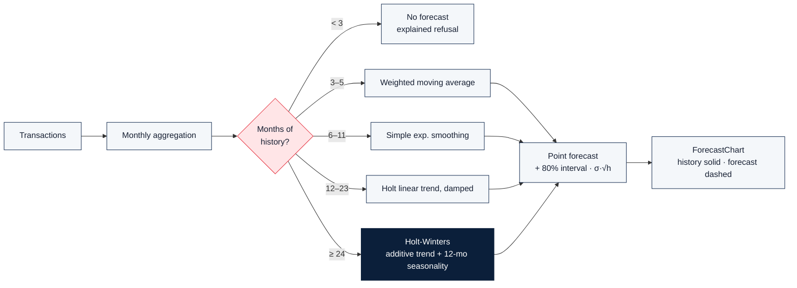

- **The model depends on how much history exists.** Fitting seasonality to five
  points gives a confident-looking line with no information in it. The models
  come from `statsmodels.tsa.holtwinters`. If fitting fails, the code falls
  back to the weighted moving average.
- **The interval** comes from the in-sample residual standard deviation and
  widens with the horizon (`σ·√h`). It is set at **80%**, because a 95% band on
  about 12 monthly points is too wide to be useful. The README states that
  roughly one month in five should fall outside it.
- **In the UI**, history is drawn as a solid line and the projection as a dashed
  line inside its band, so a projection never looks like a measurement.

---

## Receipt OCR pipeline

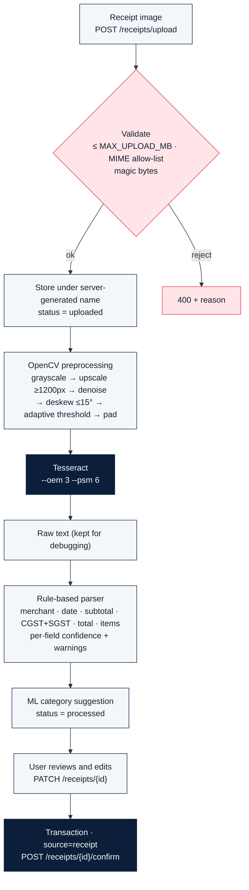

| Stage | Implementation | Why |
|---|---|---|
| **Preprocessing** | Grayscale; upscale so text height suits Tesseract's ~300 DPI models; bilateral denoise; deskew; adaptive threshold; border pad | Tesseract is much more accurate on clean, upright, high-contrast images. Each step's name is recorded in `notes[]`. |
| **Fallbacks** | OpenCV → Pillow-only → the original image | A preprocessing failure must never fail the upload |
| **OCR** | `pytesseract`, LSTM engine, `--psm 6` (one uniform block) | Suits single-column receipts |
| **Total** | Keyword-anchored ("grand total", "amount payable"); prefers the last match; falls back to the largest amount | Receipts print subtotal, then tax, then total |
| **Tax** | GST / CGST / SGST / IGST / VAT keywords; **split GST summed** | Indian receipts print CGST and SGST on separate lines |
| **Date / merchant** | Several date formats, rejecting future or implausibly old dates; merchant is the first substantial line that isn't an address, phone number or GSTIN | Receipt headers are noisy |
| **Normalisation** | Amounts become `Decimal`; missing fields become `None` **with a warning** | The parser never makes values up |

> [!CAUTION]
> **OCR limitations, stated plainly.** Rules are brittle on unfamiliar layouts
> and multi-column receipts. Only English language data is installed by
> default (`OCR_LANGUAGES=eng`). Processing runs **synchronously inside the
> request**. That is why a human review step sits between OCR and the ledger.

**A real bug caught by a test:** the amount regex once matched a *prefix* of a
digit run, turning `1923.60` into `192` + `3.60` and a ₹1,923 total into ₹3.60.
Lookbehind and lookahead guards fixed it, and a regression test covers it.

---

## Financial health score

A **deterministic, documented formula** (`services/health_service.py`), not a
model and not a credit score.

| Component | Weight | Measurement |
|---|---:|---|
| Savings rate | 30% | (income − expense) ÷ income over the last 3 months. 20% scores 85, then the score climbs more slowly. |
| Budget adherence | 20% | Actual spend against the limits set |
| Spending stability | 15% | Month-to-month expense volatility |
| Emergency fund | 15% | Months of expenses covered (target: 6) |
| Goal progress | 10% | Average progress across active goals |
| Income consistency | 10% | Variability of recorded income |

- **Components that can't be measured are excluded and the remaining weights
  are renormalised.** For example, with no goals the goal component drops out
  instead of scoring zero.
- Each component returns `score`, `weight`, `value`, `impact` and a written
  `explanation`.
- Grades: **A** ≥ 85 · **B** ≥ 70 · **C** ≥ 55 · **D** ≥ 40 · **E** below that.
- Exact scoring curves for budget adherence, stability, goals and income:
  see the code. **`[VERIFY]`** before quoting them in detail.

---

## Insight engine

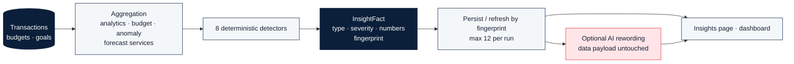

**Implemented detectors**

| Detector | Fires when |
|---|---|
| Category increase / decrease | Change vs. the previous month is **≥ 18% and ≥ ₹500** ("a 40% jump on ₹120 is noise") |
| Budget at risk / exceeded | Utilisation against a set limit |
| Unusual transactions | From the anomaly service |
| New recurring charges | A newly detected recurring pattern |
| Savings-rate change | A shift in savings rate |
| Savings opportunity | The largest category that is above its average |
| Goal behind pace | Saving is behind the pace a goal requires |
| Cash-flow shortfall | The forecast projects a shortfall |

**Why deterministic:** every number in an insight is reproducible and traceable
to the database, and each insight carries "why it matters" and a suggested
action. Fingerprints make regeneration **idempotent**: running it twice updates
existing rows instead of creating duplicates. **One failing detector is logged
and skipped** instead of taking the Insights page down.

---

## AI assistant

> [!IMPORTANT]
> **The LLM is not a source of financial facts.** It receives numbers the
> backend has already computed and is only allowed to phrase them.

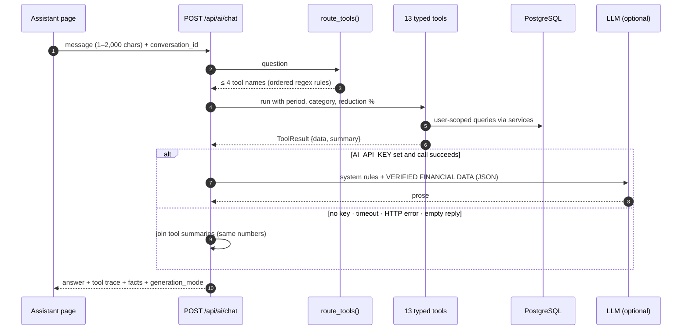

| Concern | How it is handled |
|---|---|
| **Grounding** | 13 typed tools (`get_monthly_spending`, `get_category_spending`, `get_top_merchants`, `get_budget_status`, `get_forecast`, `get_anomalies`, `get_financial_health`, `compare_periods`, `get_savings_simulation`, `get_goal_progress`, `get_goal_requirement`, `get_insights`, `get_recent_transactions`) call the existing services with the authenticated user |
| **Tool selection** | **Deterministic.** Ordered regex rules choose at most 4 tools, so the LLM doesn't pick what data is fetched. Unmatched questions fall back to monthly and category spending. |
| **Arithmetic** | In Python. "How much can I save if I cut shopping by 20%?" The percentage is parsed (default 20%, "half" means 50%) and `get_savings_simulation` computes the answer. |
| **Hallucination controls** | The system prompt: never state a number not in the verified data; say when data is missing; never invent transactions, merchants or dates; carry caveats through; no regulated investment advice |
| **Provider outage** | Any `LLMError` or missing key → a deterministic answer built from each tool's `summary`. **The figures are the same.** A test covers a broken provider. |
| **Transparency** | Each response includes `generation_mode` (`llm` \| `deterministic`) and the tool trace, both shown in the UI |
| **Vendor independence** | `LLMProvider.complete()` over plain `httpx`, supporting Anthropic, OpenAI and OpenAI-compatible APIs, chosen by `AI_PROVIDER`. The key is never logged. |

> [!NOTE]
> **Not yet implemented:** a check *after* generation that every number in the
> LLM's reply appears in the facts payload. Today the guarantee comes from the
> architecture (the model only sees verified facts) and the prompt, not from
> validating the output. This is on the roadmap.

---

## Database architecture

13 tables from one Alembic migration (`da6313565dfc_initial_schema`), mirroring
the SQLAlchemy 2.0 models in `app/models/`.

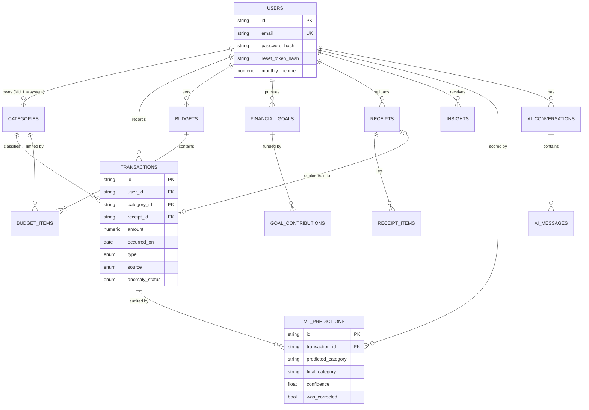

<sub>Column lists are abridged to the fields that matter for the design. See
`app/models/` for full definitions. Primary keys are UUID4 strings
(`String(36)`, `app/models/base.py`), so IDs in API paths can't be enumerated.</sub>

**Design decisions**

| Decision | Detail |
|---|---|
| **Ownership cascades** | Every user-owned table has `user_id → users.id ON DELETE CASCADE` |
| **Soft links are nulled** | Deleting a category or receipt sets `transactions.category_id` / `receipt_id` to `NULL` instead of deleting rows |
| **Money is `Numeric(14,2)`** | `Decimal` end to end in storage and business logic, never floats |
| **Uniqueness in the schema** | `UNIQUE(user_id, name)` on categories · `UNIQUE(user_id, period_month)` on budgets · `UNIQUE(budget_id, category_id)` on budget items |
| **Indexes match the queries** | Transactions: `(user_id, occurred_on)`, `(user_id, category_id, occurred_on)`, `(user_id, type, occurred_on)`, `(user_id, merchant)` |
| **Idempotent insights** | `insights.fingerprint` is indexed for update-in-place |
| **Secrets never stored in plain form** | Only `reset_token_hash` is persisted, never the raw token |

---

## API architecture

All routes are under `/api`. OpenAPI docs are at `/api/docs` and ReDoc at
`/api/redoc`. Every path below was taken from `backend/app/routers/`.

| Area | Endpoint | Purpose |
|---|---|---|
| **Auth** | `POST /auth/register` · `POST /auth/login` | Create account (201) · issue JWT |
| | `GET` `PATCH /auth/me` · `POST /auth/onboarding` | Profile and onboarding data |
| | `POST /auth/change-password` · `/forgot-password` · `/reset-password` | Password lifecycle; forgot-password responds the same way for unknown emails |
| | `POST /auth/logout` | Client-side logout for stateless JWTs; logged on the server |
| **Transactions** | `GET` `POST /transactions` · `GET` `PUT` `DELETE /transactions/{id}` | CRUD with filtering, search and a whitelisted sort |
| | `POST /transactions/categorize-preview` | Live category, confidence, alternatives and tokens |
| | `POST /transactions/bulk-delete` · `GET /transactions/payment-methods` | Bulk actions · lookups |
| | `POST /transactions/{id}/anomaly-feedback` | Confirm, expect or ignore a flag |
| **Categories / ML** | `GET` `POST /categories` · `PATCH` `DELETE /categories/{id}` · `GET /ml/categorizer-status` | Custom categories · model status and acceptance rate |
| **Budgets** | `GET` `POST /budgets` · `GET /budgets/current` · `GET` `PUT` `DELETE /budgets/{id}` | Budgets with live utilisation |
| | `GET /budgets/recommendations` · `POST /budgets/recommendations/apply` | History-based suggestions |
| **Analytics** | `GET /dashboard` · `GET /analytics/spending` | Summaries and breakdowns |
| | `GET /forecast` · `GET /health-score` · `GET /anomalies` | Forecast, score and flags |
| **Insights** | `GET /insights` · `POST /insights/generate` · `POST /insights/{id}/read` · `POST /insights/{id}/dismiss` | Insight lifecycle |
| **Goals** | `GET` `POST /goals` · `GET /goals/summary` · `GET` `PUT` `DELETE /goals/{id}` · `POST /goals/{id}/contributions` | Goals and their contribution ledger |
| **Receipts** | `GET /receipts/ocr-status` · `GET /receipts` · `POST /receipts/upload` · `POST /receipts/{id}/process` | Upload and OCR as separate steps |
| | `GET /receipts/{id}` · `GET /receipts/{id}/image` · `PATCH /receipts/{id}` · `POST /receipts/{id}/confirm` · `DELETE /receipts/{id}` | Review, correct, confirm |
| **AI** | `GET /ai/status` · `GET /ai/suggestions` · `POST /ai/chat` | Mode, prompts, grounded chat |
| | `GET /ai/conversations` · `GET` `DELETE /ai/conversations/{id}` | History |
| **System** | `GET /health` | Database, model, OCR and AI status |

**Cross-cutting behaviour**

| Concern | Implementation |
|---|---|
| Authentication | `HTTPBearer` → `get_current_user` checks signature, expiry and `type == "access"`, then loads the user. Inactive users get 403. `get_onboarded_user` returns **428** until onboarding is done. |
| Validation | Pydantic v2 schemas per domain. A custom handler returns `{"detail": "Validation failed", "errors": [{field, message, type}]}`, which the frontend maps to form fields. |
| Errors | `SQLAlchemyError` → **503** with no SQL details · unhandled → **500** with a `request_id` · cross-user access → **404**, not 403 |
| Service boundaries | Routers validate, call one service and commit. Services never import FastAPI. `ml/`, `ocr/` and `ai/` never touch the session directly. |
| API style | Resource-oriented paths with action sub-resources (`/process`, `/confirm`, `/dismiss`, `/recommendations/apply`) where CRUD doesn't fit |

---

## Frontend architecture

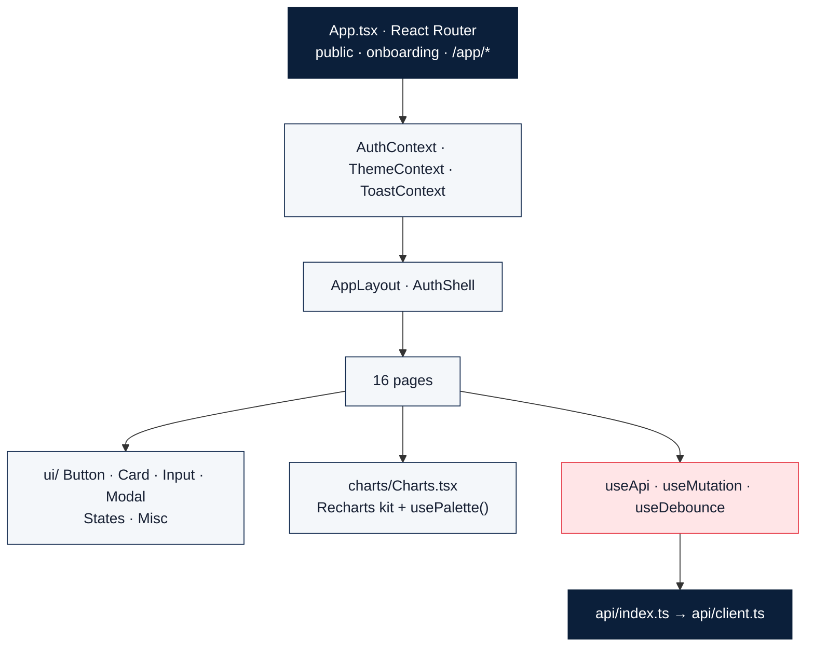

| Topic | Implementation |
|---|---|
| **Structure** | `api/` · `components/{charts,layout,transactions,ui}` · `context/` · `hooks/` · `lib/` · `pages/` · `types/` |
| **TypeScript** | API response types live in `types/index.ts`. `tsc --noEmit` runs in CI. |
| **API client** | The single `request<T>()`: Bearer header, `AbortSignal` combined with a 30 s timeout, `ApiError` with `status`, `isNetworkError` and `fieldErrors`, and a global 401 handler that clears the token |
| **State / data flow** | No global data store. `useApi` gives each view `data / loading / error / refetch / setData`. **In-flight requests are aborted on unmount or when dependencies change**, so a slow response can't overwrite a newer one. |
| **Loading & errors** | `Skeleton`, `MetricSkeleton`, `ChartSkeleton`, `TableSkeleton`, `ErrorState` (with retry), `EmptyState` and **`InsufficientDataState`**, which renders the backend's deliberate refusals |
| **Charts** | `IncomeExpenseChart`, `CategoryDonut`, `DailySpendChart`, `ForecastChart`, `CategoryBarChart`, `WeekdayChart` and `TrendSparkline` share one tooltip and palette |
| **Design system** | Tailwind tokens backed by CSS variables (`rgb(var(--navy) / <alpha-value>)`) so light and dark themes swap palettes. Inter, Plus Jakarta Sans and JetBrains Mono. Framer Motion for `Reveal`, `Counter` and `ScoreRing`. |
| **Responsive** | Tailwind breakpoints plus `useMediaQuery`. Exact mobile navigation behaviour: **`[VERIFY]`** |
| **Performance** | Vite `manualChunks` splits `react`, `charts` and `motion`, so the landing page doesn't download Recharts |

---

## Security

### Implemented

| Control | Detail |
|---|---|
| **Password hashing** | bcrypt, cost 12. Passwords over 72 bytes are SHA-256 pre-hashed so bcrypt's truncation can't discard entropy. A malformed hash fails closed. |
| **JWT** | HS256 with `sub`, `iat`, `exp`, `jti`, `type`. 720-minute default lifetime. Tests show forged tokens are rejected. |
| **Anti-enumeration** | Login runs a hash comparison even for unknown emails, so timing doesn't reveal which accounts exist. Forgot-password gives the same response either way. |
| **Reset tokens** | Only the SHA-256 hash is stored. Single-use, 30-minute expiry. Returned in the response only when `ENVIRONMENT != production`, because no mail transport is configured. |
| **Isolation** | Repository helpers require `user_id`. Cross-user access returns 404. 10 isolation tests. |
| **Validation** | Pydantic on every endpoint. Whitelisted `ORDER BY`. Parameterised SQLAlchemy queries. Search metacharacters are treated as literals (tested). |
| **Uploads** | `MAX_UPLOAD_MB` (default 8), MIME allow-list, **magic-byte verification**, server-generated filenames. nginx `client_max_body_size 12m`. |
| **CORS** | Explicit `CORS_ORIGINS` list, never `*`. Restricted methods and headers. |
| **Security headers** (nginx) | `Content-Security-Policy` (`default-src 'self'; script-src 'self'; frame-ancestors 'none'`…), `X-Content-Type-Options`, `X-Frame-Options: DENY`, `Referrer-Policy`, `Permissions-Policy`, `server_tokens off` |
| **Secrets** | Only in environment variables or `.env` (gitignored). Compose **refuses to start without `JWT_SECRET`**. Render generates it. `AI_API_KEY` is `sync: false`. The app warns at startup if the development secret is in use. |
| **Frontend/backend split** | The browser bundle holds no secrets. `VITE_API_URL` is a URL baked in at build time. The LLM key exists only on the server. |
| **Log hygiene** | A redacting filter for password, bearer, API-key, authorization and token patterns, installed on root and uvicorn loggers |
| **Container** | Backend runs as non-root (uid 10001) |

### Recommended hardening (not implemented)

- Rate limiting on `/auth/login` and `/ai/chat`
- Refresh tokens with revocation (logout is currently client-side)
- httpOnly cookie sessions instead of a `localStorage` token
- Encryption at rest for receipt images, which are currently stored
  unencrypted, as the main README states
- Transactional email for password reset

---

## Deployment architecture

### Local: Docker Compose

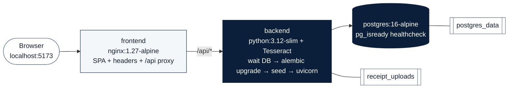

- The backend starts only after Postgres reports healthy
  (`depends_on: condition: service_healthy`).
- **The backend image trains the model during `docker build`**, so it ships
  ready to predict.
- The frontend image is a multi-stage build: `node:22-alpine` runs `npm ci` and
  `vite build`, then `nginx` serves `dist/` with SPA fallback, immutable
  `/assets/` caching and gzip.
- `entrypoint.sh` waits up to 60 s for the database, runs
  **`alembic upgrade head`**, seeds demo data if `SEED_DEMO_DATA=true` (a no-op
  when the demo user already exists), then starts uvicorn.

### Production

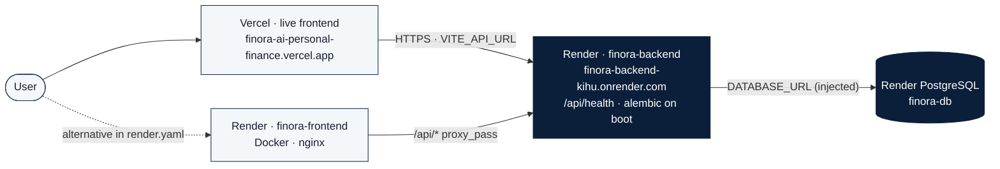

| Setting | Source (`render.yaml`) |
|---|---|
| `DATABASE_URL` | Injected from `finora-db`. `config.py` rewrites `postgres://` URLs to `postgresql+psycopg://`. |
| `JWT_SECRET` | `generateValue: true` |
| `CORS_ORIGINS` | `https://finora-frontend.onrender.com` |
| `AI_API_KEY` | `sync: false` (set in the dashboard) |
| `SEED_DEMO_DATA` | `"true"` |
| Plan | `free` for all three services |

> [!NOTE]
> **The live frontend is on Vercel:** <https://finora-ai-personal-finance.vercel.app/>. The Vercel project is
> configured in the dashboard; there is no `vercel.json` in the repository.
> The deployed bundle calls the Render API directly at
> `https://finora-backend-kihu.onrender.com/api` (set at build time through
> `VITE_API_URL`), so the Vercel origin must also be in the backend's
> `CORS_ORIGINS`. `render.yaml` additionally defines an
> nginx frontend service on Render.

---

## Engineering challenges

### 1 · Integrating ML into a web backend

**Challenge.** The model is trained by scripts at the repository root and
served from `backend/`. Separate normalisation code on each side would drift
apart silently (train/serve skew), and a missing artefact shouldn't stop the
API from starting.

**Approach.** One shared `ml` package that both sides import. A versioned
artefact with `PIPELINE_VERSION`. A cached loader behind a thread lock that
returns an "unavailable" model instead of raising. Training inside
`docker build`. Hot reload after retraining.

**Trade-off.** Keeping `sys.path` in sync and longer image builds, in exchange
for predictions that exactly match training and an image that is ready to
serve on start.

### 2 · A model that scored 100%

**Challenge.** The first synthetic dataset mapped each merchant to one
category, so the classifier was effectively a lookup table and its metrics
meant nothing.

**Approach.** Rebuilt the generator with ambiguous merchants, garbled names,
missing merchants and raw narration. Added a test that fails at accuracy 1.0.
CI checks the committed CSV regenerates byte-for-byte.

**Trade-off.** Lower headline numbers, but ones that can be trusted and
reproduced.

### 3 · Noisy OCR output

**Challenge.** Phone photos are skewed and low-contrast, receipt layouts vary,
and a regex bug read ₹1,923.60 as ₹3.60.

**Approach.** An OpenCV document pipeline with graceful fallbacks, a rule-based
parser with per-field confidence and warnings, raw text kept for debugging, a
mandatory review step, and a regression test for the regex.

**Trade-off.** Rules can be audited and run without external services, but
they are brittle on layouts they haven't seen.

### 4 · Statistics on real spending shapes

**Challenge.** Identical subscription amounts make MAD zero, and a single huge
purchase distorts mean/std-based detection.

**Approach.** Median/MAD with a mean-absolute-deviation fallback and handling
for constant series, per-category baselines with an overall fallback, and
Isolation Forest flags that also require z ≥ 2.

**Trade-off.** Fewer false alarms, but some purely multivariate oddities with a
normal amount will be missed.

### 5 · Unreliable AI output

**Challenge.** LLMs make up plausible figures, and provider calls time out or
fail.

**Approach.** Deterministic routing and retrieval, arithmetic in Python, a
constrained prompt, a deterministic fallback with the same figures, and
`generation_mode` shown in the UI.

**Trade-off.** Regex routing is less flexible than LLM tool-calling, in
exchange for predictable, testable behaviour that works offline.

### 6 · Database migrations

**Challenge.** Migrations that only go forward are hard to recover from, and
SQLite in local development ignores foreign keys by default, so cascades
behave differently from Postgres.

**Approach.** Alembic owns the Postgres schema. CI runs **upgrade → downgrade
→ upgrade** against Postgres 16. SQLite gets `PRAGMA foreign_keys=ON`. The
entrypoint waits for the database before migrating.

**Trade-off.** Every migration needs a working `downgrade()`, which is more
work per schema change.

### 7 · Frontend/backend environment configuration

**Challenge.** The SPA has to reach the API from the Vite dev server, from
Docker Compose and from Render, without holding secrets and without CORS
friction.

**Approach.** A relative `/api` base URL. Vite proxies it in development and
nginx in containers, so the browser always sees one origin. `VITE_API_URL` is
a build argument.

**Trade-off / open issue.** Commit `b6a88f8` changed the shared `nginx.conf` to
`proxy_pass https://finora-backend.onrender.com/api/`. As a result the local
Compose frontend now proxies to the *production* backend, and `Host $host` may
not route correctly on Render **`[VERIFY]`**. The planned fix is to template the
upstream (`envsubst` + `BACKEND_UPSTREAM`) and add `proxy_ssl_server_name on`.

### 8 · Build configuration on deploy

**Challenge.** `npm run build` (`tsc -b && vite build`) failed because
`vite.config.ts` uses `node:path` and `__dirname` without Node type
definitions.

**Approach.** Commit `f3d7aa4` added `@types/node`.

**Trade-off.** A small fix, but a reminder to run exactly the typecheck and
build that the host runs before deploying.

---

## Key engineering decisions

| Decision | Why | Trade-off |
|---|---|---|
| **FastAPI + Pydantic v2** | Typed request/response schemas, automatic OpenAPI, dependency injection for the auth gate, the same language as the ML stack | Sync SQLAlchemy sessions in a framework often chosen for async; CPU work (OCR) blocks a worker |
| **PostgreSQL + `Numeric(14,2)`** | Exact money arithmetic, relational integrity, cascades, composite indexes | Needs a managed database in production (the SQLite fallback is for development only) |
| **Layered router → service → repository** | Isolation enforced in one layer; services testable without HTTP | More files and indirection for simple CRUD |
| **TF-IDF + Logistic Regression** | Fast CPU training, probability scores, explainable coefficients, trained at build time | Limited semantic understanding; needs feature engineering |
| **Confidence gate at 0.45** | A silent wrong category costs more than asking the user | More prompts on ambiguous merchants |
| **Deterministic insights, health score and budgets** | Reproducible, explainable, testable to exact values | Detectors are hand-written and need tuning |
| **LLM phrases only; regex routing** | No invented numbers, resistance to prompt injection, works without a key | Unusual phrasings may route poorly |
| **Rule-based OCR with OpenCV preprocessing** | Auditable, on-server, no GPU, per-field confidence | Brittle on unfamiliar layouts |
| **Forecast depends on history; 80% interval; refusal below 3 months** | No false confidence from short series | New users get no forecast |
| **Compute derived values on read** | Can't drift from the ledger | Repeated work per request; no cache yet |
| **Docker + separate frontend and backend services** | Tiers scale and fail independently; the same images run locally and on Render | Proxy configuration needed for each environment |
| **Stateless JWT** | No session store; scales horizontally | No revocation until expiry |

---

## Testing

| Suite | Tooling | What it covers |
|---|---|---|
| **Backend unit + API** | pytest, **against PostgreSQL 16 in CI** | 236 test functions across 7 modules (auth, transactions, budgets, analytics, goals/insights/AI, ML, OCR). The main README reports 281 collected tests including parametrised cases. |
| **ML** | pytest + a dedicated CI job | Accuracy band `0.80 ≤ acc < 1.0`; dataset reproducibility; train with CV; evaluate the saved artefact; `ml.predict` smoke tests |
| **Frontend** | Vitest + Testing Library + jsdom | 36 tests: API client (9), formatting (20), state components (7) |
| **Build verification** | CI | `tsc --noEmit`, `vite build`, both Docker images, `tesseract --version` inside the backend image |
| **Migrations** | CI | Alembic upgrade → downgrade → upgrade; end-to-end demo seed |
| **Static analysis** | CI | Ruff lint + format check; ESLint `--max-warnings 0` |

**Tests that check behaviour, not just status codes**

- 10 **data-isolation** tests: user B can't read, update, delete or aggregate
  user A's data
- **Forged JWTs** (wrong secret) are rejected
- **SQL metacharacters** in search are treated as literals
- **An executable renamed to `.png`** is rejected on magic bytes; filenames
  can't traverse paths
- The **worked budget example** 8,000 → 9,200 → 10,100 → 9,800 must give exactly **₹9,750**
- A **broken LLM provider** still yields the correct figures
- **Honest refusals:** forecasting below 3 months, anomalies below 12
  transactions, recommendations below 2 months

The main README records that **four real bugs** were found by these tests
during development.

**Not yet implemented:** end-to-end browser assertions (Playwright is used only
for screenshots), page-level React tests, load tests, an OCR accuracy benchmark
on labelled receipts, and OpenAPI/TypeScript contract tests.

---

## Observability & reliability

### Implemented

| Mechanism | Detail |
|---|---|
| **`GET /api/health`** | Reports database connectivity, model availability, version and training date, OCR availability and AI mode. Returns **503 only if the database is down**; optional subsystems are reported, not required. |
| **Container health checks** | Backend: `curl /api/health` every 30 s. Frontend: `wget /`. Postgres: `pg_isready` with the named user and DB. Render: `healthCheckPath: /api/health`. |
| **Request tracing** | `X-Request-ID` (reused from the client if sent) and `X-Process-Time-Ms` on every response. 4xx and 5xx responses are logged with the id. |
| **Structured logging** | A consistent format; SQLAlchemy and httpx noise suppressed; secrets redacted |
| **Error handling** | Validation 422 with fields · DB 503 without leaking details · unhandled 500 with `request_id` |
| **Startup diagnostics** | Logs model, OCR and AI availability, and warns on a default `JWT_SECRET` |
| **Migration strategy** | Alembic `upgrade head` on every container start; reversibility checked in CI |
| **Fault isolation** | A failing insight detector or assistant tool is logged and skipped, not propagated |

### Planned

JSON logs · OpenTelemetry tracing · metrics (latency, error rate, OCR duration,
LLM fallback rate) · error tracking · ML monitoring from `ml_predictions`
(acceptance rate, confidence drift).

---

## Current state

| Status | Area |
|---|---|
| ✅ Implemented | Auth (register, login, onboarding, password reset), transactions, categories |
| ✅ Implemented | ML categorisation with confidence gate, explanations and correction logging |
| ✅ Implemented | Retraining from corrections (**manual CLI steps**, not automated) |
| ✅ Implemented | Receipt OCR with review-before-confirm |
| ✅ Implemented | Anomaly detection, forecasting, health score, 8-detector insight engine |
| ✅ Implemented | Budgets with history-based recommendations; goals with contributions |
| ✅ Implemented | AI assistant with 13 tools and a deterministic fallback |
| ✅ Implemented | Light/dark themes, Docker Compose, CI, Render blueprint |
| ✅ Implemented | Frontend deployed on Vercel: [https://finora-ai-personal-finance.vercel.app/](https://finora-ai-personal-finance.vercel.app/) |
| 🚧 In progress | nginx proxy upstream shared between local and Render environments (see challenge 7) |
| 🔮 Future | Background jobs, rate limiting, token revocation, object storage for receipts |
| 🔮 Future | Bank integration, CSV import, multi-currency, shared budgets, mobile app (listed as "not built" in the main README) |

---

## Future roadmap

> [!NOTE]
> Everything below is **future work**. None of it is implemented.

| Phase | Focus | Concrete steps |
|---|---|---|
| **1 · Evaluation** | Better ML evaluation | Labelled benchmark of real (consented, anonymised) narrations, kept separate from the synthetic training data; per-class error analysis; a promotion gate that blocks regressions |
| **2 · OCR** | Improved OCR | Layout-aware line-item parsing, a merchant dictionary, multilingual Tesseract packs, an accuracy benchmark on labelled receipts |
| **3 · Platform** | Background jobs | Queue (for example Redis + a worker) for OCR, anomaly scans, insight generation and retraining; object storage for receipts |
| **4 · MLOps** | Model monitoring | Acceptance and correction rates, confidence drift and category drift from `ml_predictions`; scheduled export → train → evaluate → hot reload |
| **5 · Forecasting** | Richer forecasting | Separate income and expense models, recurring-charge awareness, backtested interval coverage |
| **6 · Hardening** | Security and delivery | Rate limiting, refresh tokens, httpOnly sessions, post-generation LLM number checks, CI/CD with preview environments, templated nginx upstream |

---

## What I learned

- **Full-stack architecture.** Giving each layer one job meant that per-user
  isolation is enforced once in the repository layer, instead of relying on
  every route to remember it.
- **Production ML.** The model was the smaller part of the work. Shared
  preprocessing, versioned artefacts, confidence policies, a missing-model code
  path and a correction loop took most of the effort. A perfect score was a
  sign the dataset was wrong.
- **API design.** Action sub-resources, one error shape, field-level validation
  errors and explicit "insufficient data" responses made the frontend simpler
  and more honest.
- **Database design.** `Decimal` for money, computing derived values instead of
  storing them, schema-level uniqueness, and indexes designed from real query
  patterns. Migrations have to be reversible and tested on the real engine.
- **OCR.** Most of the accuracy comes from preprocessing. The remaining errors
  are best handled by showing confidence and asking the user, not by guessing.
- **Deployment.** A setup that works in Compose still needs changes for a
  managed host: proxy upstreams, build-time variables, missing type packages.
  Configuration should be templated, not edited in place.
- **Security.** Controls that apply by default (magic bytes, log redaction,
  404 for cross-user access, hashed reset tokens) do more than per-route
  checks. The remaining gaps should be written down.
- **AI system design.** A language model is good at wording and unreliable as
  a data source. An assistant that stays correct with the model switched off
  is one people can trust.

---

## Interview talking points

<details>
<summary><b>1. Why FastAPI?</b></summary>

Pydantic v2 schemas give typed validation and automatic OpenAPI docs for 64
routes. Dependency injection makes `get_current_user` a single auth gate. It is
Python, so scikit-learn, statsmodels and OpenCV run in-process without a
separate model service. The honest caveat: the app uses synchronous SQLAlchemy
sessions and runs OCR in the request, so CPU-heavy work blocks a worker. The
fix is background jobs, not a different framework.
</details>

<details>
<summary><b>2. Why TF-IDF + Logistic Regression instead of a transformer?</b></summary>

Transaction text is short and merchant-heavy. Word n-grams capture merchants
and character n-grams handle spelling noise like `SWGGY`. Logistic Regression
trains in seconds on a CPU (so it trains inside `docker build`), gives
probabilities for the confidence gate, and has inspectable coefficients, so the
UI can show honest token-level explanations. A transformer would add GPU cost
and opacity for a task where the signal is mostly lexical.
</details>

<details>
<summary><b>3. How do you prevent train/serve skew?</b></summary>

One `ml/preprocessing.py` is imported by both `ml.train` and the API. The
artefact stores a `PIPELINE_VERSION`, and the loader warns on a mismatch. The
Docker build regenerates the dataset and retrains, so the artefact always
matches the committed code.
</details>

<details>
<summary><b>4. How does the OCR pipeline work, and where does it fail?</b></summary>

Magic-byte validated upload → OpenCV (grayscale, upscale, denoise, deskew,
adaptive threshold) → Tesseract `--psm 6` → a rule-based parser for merchant,
date, subtotal, summed CGST + SGST, total and items, each with a confidence
score → user review → confirm. It struggles with unfamiliar and multi-column
layouts, and it runs synchronously. A missing field returns `None` with a
warning instead of a guess, and nothing reaches the ledger without
confirmation.
</details>

<details>
<summary><b>5. How do you prevent AI hallucinations?</b></summary>

The model never decides what to fetch (regex routing), never touches the
database, and never does arithmetic (Python computes everything, including "cut
shopping by 20%"). It receives a JSON block of verified facts and a prompt
forbidding any other number. With no key or on any failure, a deterministic
explainer returns the same figures. What's still missing is automatic
validation of the model's output against the facts.
</details>

<details>
<summary><b>6. How does anomaly detection avoid false alarms?</b></summary>

It uses the median and MAD instead of mean and std, so one huge purchase can't
hide itself. Baselines are per category. An Isolation Forest flag counts only if
the amount is also at least 2 robust deviations out. Detection is skipped below
12 transactions, only the last 90 days are newly flagged, and anything the user
marks as expected is never flagged again.
</details>

<details>
<summary><b>7. How does forecasting handle short histories?</b></summary>

The model depends on how many months exist: weighted moving average at 3+,
simple exponential smoothing at 6+, damped Holt at 12+, Holt-Winters with
12-month seasonality at 24+. Below 3 months there is no forecast and the API
says why. The interval is 80%, widening with `σ·√h`.
</details>

<details>
<summary><b>8. How is user data isolated?</b></summary>

Every repository helper requires `user_id`. There is no query path without an
owner. Cross-user access returns 404 so resource existence isn't revealed, and
10 tests check reads, updates, deletes and aggregates across two users.
</details>

<details>
<summary><b>9. How would you scale this system?</b></summary>

The API tier is stateless apart from receipts on local disk. So: move receipts
to object storage, then run multiple API replicas. Move OCR, anomaly scans,
insights and retraining to a job queue. Cache or materialise per-user monthly
aggregates, since derived values are currently recomputed on every read. Add
Postgres read replicas for analytics. No load tests exist yet, so the first
step would be measuring.
</details>

<details>
<summary><b>10. How would you monitor ML drift?</b></summary>

`ml_predictions` already records every prediction's input, confidence,
predicted versus final category and `was_corrected`. I'd track the acceptance
rate and confidence distribution per category over time, alert on drops, and
gate retrained models on a fixed labelled benchmark before hot-reloading them.
</details>

<details>
<summary><b>11. How do you secure financial data?</b></summary>

What exists: bcrypt, signed JWTs, enumeration-safe auth, hashed reset tokens,
isolation enforced in the repository layer, Pydantic validation, magic-byte
uploads, strict CORS, CSP and security headers, secrets only in environment
variables, redacted logs, and a non-root container. What I'd add next: rate
limiting, token revocation, httpOnly cookies, and encryption at rest for
receipt images.
</details>

<details>
<summary><b>12. What would you change first?</b></summary>

Template the nginx upstream so local and production proxies stop sharing one
hardcoded URL. Move OCR to a background job. Add a check that every number in
an LLM reply exists in the facts payload.
</details>

---

## Project structure

The main application repository,
[`finora-ai-personal-finance`](https://github.com/Divyanshi12coder/finora-ai-personal-finance):

```text
finora-ai-personal-finance/
├── backend/
│   ├── alembic/                 # env.py + versions/da6313565dfc_initial_schema.py
│   ├── app/
│   │   ├── ai/                  # assistant.py · provider.py · tools.py
│   │   ├── ml/                  # anomaly.py · categorizer.py · forecasting.py
│   │   ├── models/              # SQLAlchemy models (13 tables)
│   │   ├── ocr/                 # preprocess.py · engine.py · parser.py
│   │   ├── repositories/        # transaction_repository.py
│   │   ├── routers/             # auth · transactions · budgets · analytics · insights · goals · receipts · ai
│   │   ├── schemas/             # Pydantic request/response models
│   │   ├── services/            # 14 business-logic services
│   │   ├── utils/               # dates · money · security
│   │   ├── config.py · database.py · deps.py · logging_config.py · main.py · seed.py
│   ├── tests/                   # 7 pytest modules + conftest.py
│   ├── Dockerfile · entrypoint.sh · alembic.ini · pytest.ini · requirements.txt
├── frontend/
│   ├── src/
│   │   ├── api/  components/  context/  hooks/  lib/  pages/  types/  test/
│   ├── scripts/capture-screenshots.mjs
│   ├── Dockerfile · nginx.conf · vite.config.ts · vitest.config.ts · tailwind.config.js · package.json
├── ml/
│   ├── build_dataset.py · dataset.py · pipeline.py · preprocessing.py
│   ├── train.py · evaluate.py · predict.py · export_corrections.py · model_store.py · paths.py
│   └── datasets/seed_transactions.csv
├── docs/assets/                 # banner, logo, architecture SVG, screenshots
├── .github/                     # workflows/ci.yml · workflows/lint.yml · dependabot · templates
├── docker-compose.yml · render.yaml · pyproject.toml · .env.example · LICENSE · README.md
```

This case-study repository:

```text
finora-ai-case-study/
├── README.md
├── index.html                   # interactive case-study website (GitHub Pages ready)
├── LICENSE
└── docs/images/                 # real screenshots + SVGs copied from the main repo
```

---

## Local development

All commands match the main repository.

### Docker (recommended)

```bash
git clone https://github.com/Divyanshi12coder/finora-ai-personal-finance.git
cd finora-ai-personal-finance
cp .env.example .env
python -c "import secrets; print(secrets.token_urlsafe(48))"   # paste into JWT_SECRET in .env
docker compose up --build
```

Open **http://localhost:5173** and sign in as `demo@finora.app` / `FinoraDemo123!`.
API docs are at **http://localhost:8000/api/docs**.

> [!WARNING]
> In the current `main`, `frontend/nginx.conf` proxies `/api` to the Render
> backend (commit `b6a88f8`). For a fully local stack, change `proxy_pass`
> back to `http://backend:8000/api/` before building.

### Without Docker

```bash
# Backend
cd backend
python -m venv .venv && source .venv/bin/activate      # Windows: .venv\Scripts\activate
pip install -r requirements.txt
cp .env.example .env                                    # set DATABASE_URL and JWT_SECRET

createdb finora
python -m alembic upgrade head                          # PostgreSQL schema

cd .. && python -m ml.build_dataset && python -m ml.train && cd backend
python -m app.seed
uvicorn app.main:app --reload --port 8000
```

```bash
# Frontend (Vite proxies /api to :8000)
cd frontend && npm install && npm run dev
```

Leaving `DATABASE_URL` empty falls back to a local SQLite file, which is a
development convenience that is logged at startup. Receipt OCR needs Tesseract
on the host (`TESSERACT_CMD` on Windows). It is already installed in the
Docker image.

### Checks

```bash
cd backend && pytest
cd ../frontend && npm run typecheck && npm run lint && npm test && npm run build
cd .. && ruff check backend/app backend/tests ml && ruff format --check backend/app backend/tests ml
```

### Key environment variables

| Variable | Required | Purpose |
|---|---|---|
| `DATABASE_URL` | Production | PostgreSQL connection; empty → SQLite dev fallback |
| `JWT_SECRET` | **Yes** | Token signing key |
| `CORS_ORIGINS` | Yes | Comma-separated allowed origins (never `*`) |
| `AI_PROVIDER` · `AI_API_KEY` · `AI_MODEL` · `AI_BASE_URL` | No | Optional LLM phrasing; no key → deterministic explainer |
| `TESSERACT_CMD` · `OCR_LANGUAGES` | No | OCR binary and languages |
| `MAX_UPLOAD_MB` · `ALLOWED_UPLOAD_TYPES` | No | Upload limits (default 8 MB) |
| `ENVIRONMENT` · `LOG_LEVEL` · `SEED_DEMO_DATA` | No | Runtime mode, verbosity, demo seeding |
| `VITE_API_URL` | Frontend build | API base URL, never a secret (default `/api`) |

---

## License

Released under the [MIT License](LICENSE), the same license as the main
Finora repository. Screenshots show fictional seeded data.

> Finora provides educational insights from data you enter. It is not
> financial, investment, tax or legal advice. The health score is an
> application metric, not a credit score.

---

<div align="center">


**Built by Divyanshi**

[Live demo](https://finora-ai-personal-finance.vercel.app/) ·
[GitHub](https://github.com/Divyanshi12coder) ·
[Finora source](https://github.com/Divyanshi12coder/finora-ai-personal-finance)

<sub>Designed so that every number can be traced back to the code or data that produced it.</sub>

</div>
